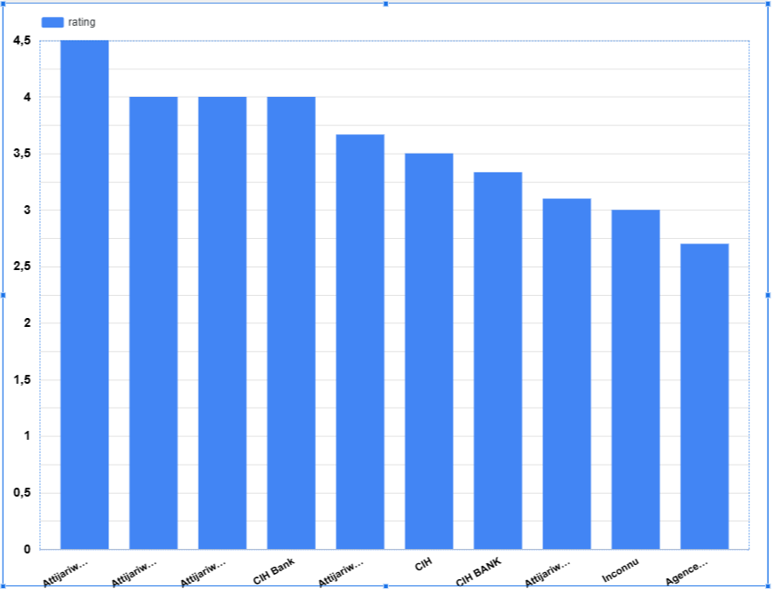
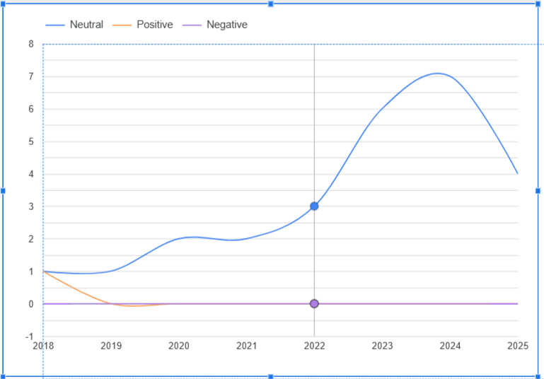
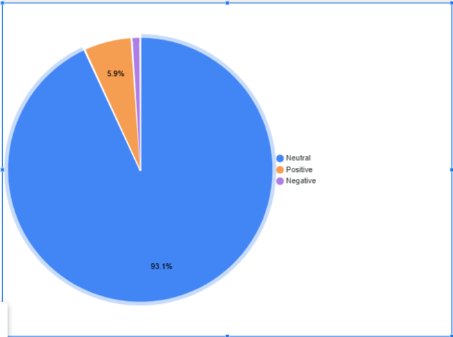
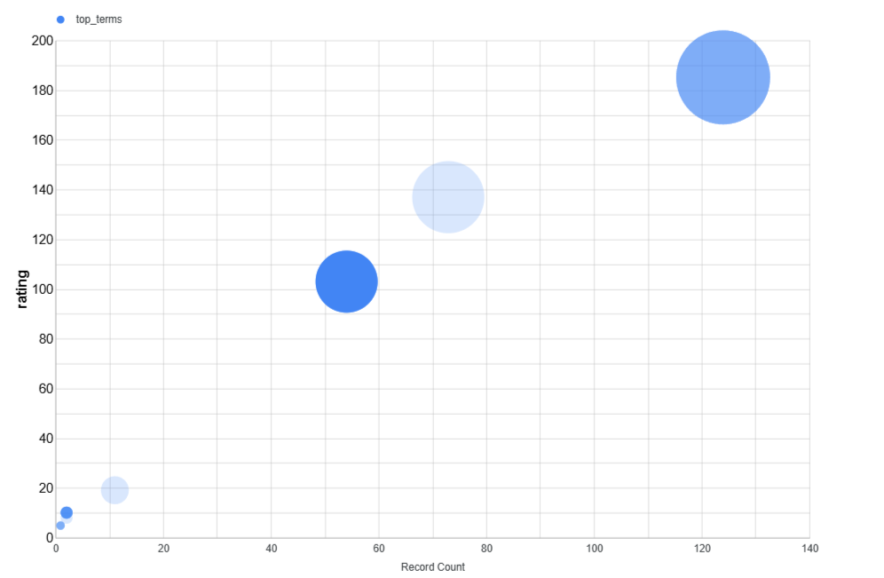

# 🇲🇦 Bank Reviews Analysis in Morocco
📌 A full data engineering pipeline to analyze customer reviews of Moroccan banks using scraping, NLP, Airflow and PostgreSQL

## 🧠 About the Project
This project was created as part of a personal academic initiative to better understand public opinion on banking services in Morocco. By collecting reviews from Google Maps and processing them with modern data tools, this pipeline aims to uncover patterns, satisfaction levels, and customer concerns in different regions.

✅ Project scope: multiple Moroccan cities & banks
🎓 Tools: Python, Airflow, PostgreSQL, NLP, DBT, Looker Studio

## 🔍 Objectives
Automatically collect reviews from Google Maps for bank branches across Morocco.

Clean and standardize the raw data.

Enrich reviews with language detection, sentiment classification, and topic modeling.

Store and organize the data in a PostgreSQL database.

Visualize insights using an interactive dashboard.

## 🚀 How to Run the Project
1. Clone the repository

git clone https://github.com/yourusername/bank-reviews-analysis.git
cd bank-reviews-analysis

2. Set up the environment

python -m venv env
source env/bin/activate
pip install -r requirements.txt

## 🌀 ETL Orchestration with Airflow
Apache Airflow is used to schedule and monitor all ETL tasks.

Quick 

pip install apache-airflow
airflow db init

DAGs Folder Structure
Ensure your DAGs are located in:

~/airflow/dags/

Then start Airflow:

airflow webserver
airflow scheduler

Access the UI at: http://localhost:8080

## 🧱 Tech Stack

| Layer           | Tool                                        |
| --------------- | ------------------------------------------- |
| Data Extraction | Playwright, BeautifulSoup                   |
| Processing      | Python                                      |
| NLP Enrichment  | Language Detection, Sentiment Analysis, LDA |
| Data Storage    | PostgreSQL                                  |
| Orchestration   | Apache Airflow                              |
| Transformation  | DBT                                         |
| Visualization   | Looker Studio                               |

## 📊 Dashboard Overview
The dashboard built with Looker Studio includes:

Sentiment trends by region and by bank

Topics mentioned in reviews (via LDA)

Review volume over time

Ratings distribution

Comparative satisfaction among banks
You can explore the insights generated by this project via the Looker Studio dashboard: https://lookerstudio.google.com/reporting/bfbfa7e0-d240-443d-bf20-789eb283c285

Here’s a quick preview:

